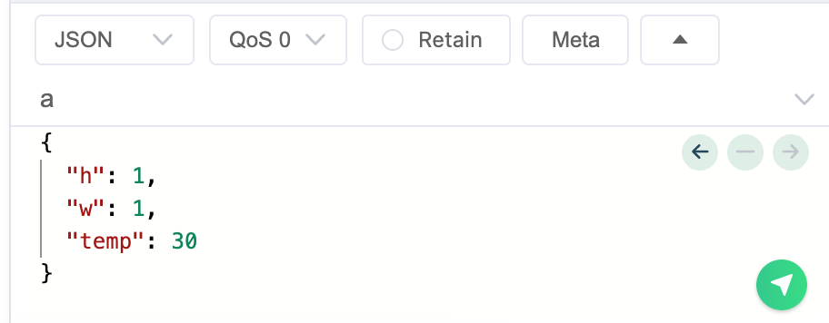

# MQTT-Based Rule Engine

# Overview

The MQTT-Based Rule Engine is a versatile solution designed for real-time rule evaluation and action execution. Built on the MQTT protocol, this engine connects to any MQTT broker, making it adaptable for diverse use cases.

# Key Features

1. MQTT Protocol Compatibility: The engine seamlessly connects to any MQTT broker, providing flexible integration options.
2. SQL Syntax for Rule Writing: Rules use familiar SQL syntax, with the "FROM" clause serving as a topic filter for intuitive rule evaluation.
3. Native Distributed Support: Built for distributed environments, the engine enables scalable rule processing across multiple nodes.
4. Plugin System for Integration: A flexible plugin system lets users integrate downstream services and develop custom actions for specific business needs.

# Architecture


## Core Components

### ProcessorWorker

The ProcessorWorker receives messages from MQTT brokers through shared subscription. It contains multiple MQTT clients to handle this task. When a message arrives, the worker uses the `Router` to find matching rules.

### Router

It matches rules based on the incoming message's topic.

### Processor

The Processor executes actions based on matched rules. It uses the rule's destination information to find the appropriate destination plugin for message delivery.

# QuickStart

- Start a MQTT broker

```bash
docker pull bifromq:latest
docker run --network host -d --name bifromq bifromq/bifromq:latest
```

- Start the BifroRE instance

```bash
./bin/standalone.sh start
```

- Add a `Destination`
```bash
curl -X PUT http://localhost:8088/destination \
     -H "Content-Type: application/json" \
     -d '{
           "destinationType": "kafka",
           "cfg": {
             "bootstrap.servers": "127.0.0.1:9092",
             "acks": "all"
           }
         }'
```
The output will be like:
```json
{
  "destinationId":"kafka/bf488e92-d26c-45ba-8915-e82bd07b66f0"
}
```
Currently, BifroRE adds Kafka and DevOnly (output the messages to log) as its builtin producers.

- Add A Rule and Test

```bash
 # Add a basic rule
 curl -X PUT http://localhost:8088/rule -d '{"expression": "select * from a", "destinations": ["kafka/bf488e92-d26c-45ba-8915-e82bd07b66f0"]}'
 # Add a filtering and mapping rule
 curl -X PUT http://localhost:8088/rule -d '{"expression": "select 2*h as new_height, 2*w as new_width from \"a/b/c\" where temp > 25", "destinations": ["kafka/bf488e92-d26c-45ba-8915-e82bd07b66f0"]}'
 # List the existing rules
 curl http://localhost:8088/rule
```

- Send a message on topic `a`

**NOTE** the `WHERE` and `SELECT` clauses for the rule depend on the payload's fields. Therefore, the message must be 
JSON-decoded; otherwise, it will be dropped. If you're using MQTTX, the format should be as follows:


You can use any MQTT client tools (such as MQTTX) to send a message on the rule's topic. The rule engine will process 
the message based on the given rule and send the processed messages to the destinations.

- Delete a `Destination`
```bash
curl -X DELETE "http://localhost:8088/destination?destinationId=$YOUR_DESTINATION_ID
```

- Delete a `Rule`
```bash
curl -X DELETE "http://localhost:8088/rule?ruleId=$YOUR_RULE_ID"
```
The corresponding rule will be deleted. If all the rules are deleted for a given topicFilter, the rule engine will 
unsubscribe the topicFilter.

Note: The destinationId is part of the rule, if the user deletes a destinationId, the processing for this deleted 
destination will be ignored silently.

# Messaging

The source message comes from the MQTT broker cluster, and the rule engine service is connected via the MQTT protocol.  
To ensure messages are not lost, the default `QoS` level is set to `QoS = 1`, meaning the message will be delivered **at least once**.

For each message, multiple rules may match the message's topic, and a rule can have multiple destinations. The rule 
engine will send an `ACK` back to the MQTT broker cluster only after the message has been delivered to all matched destinations.

**NOTE**: The rule engine uses a plugin system, which allows users to implement customized plugins for delivering 
messages to their target destinations. Therefore, the definition of "delivery" is user-defined.

Currently, the rule engine includes built-in destinations for Kafka and development environments only. For the Kafka 
destination, "delivery" is defined as the successful sending of the message to the Kafka cluster.