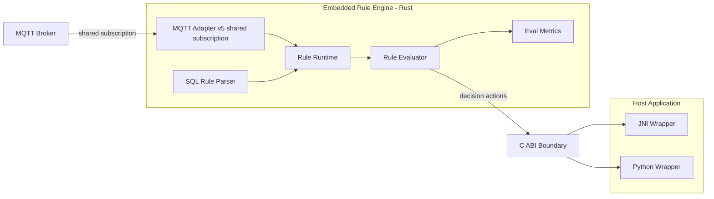

# METRE (MQTT Event Transform Rule Engine)

METRE is an MQTT rule engine delivered as an embedded Rust library with a C ABI
and as a standalone OSS binary.
It connects to an MQTT broker via shared subscriptions, evaluates SQL-like rules in memory,
and emits evaluation results either to the host application (JNI / Python / C) or built-in sinks.

## Architecture


```mermaid
flowchart LR
  subgraph Host[Host Application]
    JNI[JNI Wrapper]
    PY[Python Wrapper]
  end

  CABI[C ABI Boundary]

  subgraph Engine[Embedded Rule Engine - Rust]
    ADP[MQTT Adapter v5 shared subscription]
    PARSE[SQL Rule Parser]
    RT[Rule Runtime]
    EVAL[Rule Evaluator]
    METRICS[Eval Metrics]
  end

  Broker[MQTT Broker]

  Broker -->|shared subscription| ADP
  ADP --> RT
  PARSE --> RT
  RT --> EVAL
  EVAL --> METRICS
  EVAL -->|decision actions| CABI

  CABI --> JNI
  CABI --> PY

```

## Background

- Old: standalone Java services (router/processor/admin). New: embedded Rust library with C ABI.
- Old: rule matching done in Java router. New: in-memory trie matcher in Rust.
- Old: SQL rules parsed by Trino + MVEL. New: SQL subset parser in Rust with MQTT-native extensions.
- Old: downstream delivery handled by built-in plugins. New: host application handles destinations.

The original Java standalone implementation is preserved in the `java-standalone` branch.

## Rule DSL (SQL + MQTT extensions)

Examples:
- Topic filters and alias:
  - `select * from 'sensors/+/temp' as t`
- Topic level function:
  - `where topic_level(t, 2) = 'room1'`
- Metadata/properties:
  - `where qos >= 1 and properties['content-type'] = 'application/json'`

Supported (current):
- `SELECT *` or `SELECT expr [AS alias]`
- `FROM <topic filter>` with `+` and `#` wildcards
- `WHERE` with `AND/OR`, comparisons, arithmetic
- `topic_level(alias, index)` (1-based index)
- Metadata: `qos`, `retain`, `dup`, `timestamp`, `clientId`, `username`
- MQTT v5 properties via `properties['key']`

## Recent Features & Optimizations

- Global payload decode mode at engine init: `JSON` or `Protobuf`.
- Protobuf support for typed payloads (schema-based, `prost` generated messages).
- Compiled expression plan with constant folding at rule compile time.
- Internal coordinator boundary for OSS file-based rule/client-id sources and future control-plane sources.

## Build

Requirements:
- Rust (cargo)
- For JNI: JDK (JAVA_HOME set)

Build the artifacts:

```bash
./build.sh java    # platform jar with bundled native libraries
./build.sh python  # platform wheel with bundled native library
./build.sh oss     # standalone metre-oss binary
./build.sh all     # java + python + oss
./scripts/test.sh core        # engine core tests
./scripts/test.sh jni               # JNI related test cases
./scripts/test.sh java-integration  # Java integration test cases
./scripts/bench.sh rust       # Rust benchmarks
./scripts/bench.sh jmh        # Java JMH benchmarks
```

Optional feature flags (manual cargo usage):

```bash
# core with SIMD JSON parser
cargo build -p metre-core --features simd-json

# ffi with mqtt + SIMD JSON parser
cargo build -p metre-ffi --features "mqtt simd-json"
```

Note: `simd-json` is workload and platform dependent; it is not guaranteed to be faster than
`serde_json` in every case.

Artifacts are placed under `build/`:
- `libmetre_embed.(so|dylib)`
- `libmetre_jni.(so|dylib)` (JNI)
- `metre-<version>-<platform>.jar`
- `metre-0.1.0-*.whl`
- `metre-oss-<version>-<platform>`

Java jar filenames include the native platform, for example
`metre-0.1.0-linux-x86_64.jar` or `metre-0.1.0-darwin-aarch64.jar`.
The wheel keeps the standard Python platform tag.

## Standalone OSS Binary

For quick trials, build and run the standalone process:

```bash
./build.sh oss
./build/metre-oss-0.1.0-darwin-aarch64 -c examples/metre-oss/config.json
```

On Linux release artifacts, use:

```bash
./metre-oss-0.1.0-linux-x86_64 -c config.json
```

The OSS binary currently provides:
- MQTT input using the same rule engine core.
- File-based rule and client-id loading through the OSS coordinator.
- Built-in log sink for evaluated messages.
- Kafka sink backed by an asynchronous Kafka producer and `sinks.kafka` config.

Minimal config:

```json
{
  "rule_json_path": "examples/metre-oss/rule.json",
  "client_ids_path": "examples/metre-oss/client_ids",
  "payload": { "format": "json" },
  "mqtt": {
    "host": "127.0.0.1",
    "port": 1883,
    "username": "dev",
    "password": "dev"
  },
  "sinks": {
    "log": {},
    "kafka": {
      "bootstrap_servers": ["127.0.0.1:9092"],
      "topic": "metre-output",
      "properties": {
        "queue.buffering.max.messages": "100000",
        "batch.num.messages": "1000",
        "linger.ms": "5",
        "acks": "1"
      }
    }
  },
  "metrics": {
    "detailed_latency": false
  }
}
```

## Client ID Provisioning

MQTT persistent sessions are stateful on the broker side. In METRE, the client-id file is the
source of truth for those sessions.

Runtime behavior:
- If the client-id file exists, METRE loads and uses those IDs as-is.
- If the file does not exist, METRE generates plain defaults: `nodeId_index`.
- If the client-id file count does not match the requested `client_count`, METRE aligns to the
  file count instead of the requested count.

This is intentional: persistent MQTT sessions are mapped to client IDs, so session continuity is
more important than treating `client_count` as a stateless scaling knob.

If you need broker-specific client-id placement, provision the file before starting METRE.
That control-plane logic is intentionally kept out of this open-source tree. The runtime remains
broker-neutral and simply consumes a client-id file when provided.

This file-based policy is not a generic requirement for all MQTT brokers. Other brokers may not
care about client-id patterns at all, or may require a different pattern. METRE runtime behavior
remains clear and neutral:
- load client IDs from file if present
- otherwise generate plain `nodeId_index` defaults
- treat the client-id file as authoritative for persistent-session continuity

If your broker needs a different provisioning policy, generate the client-id file with your own
tooling and let METRE consume it unchanged.

## Examples

- Java example and Maven integration: `examples/java/README.md:1`
- Python example and wheel install flow: `examples/python/README.md:1`

## Protobuf Input

The release contract is:

- JSON input
- protobuf input with:
  - a descriptor-set file
  - per-rule fully-qualified schema names

Rust embed usage:

```rust
use metre_core::payload::dynamic_protobuf_registry_from_descriptor_set_file;
use metre_core::runtime::RuleEngine;

let decoder = dynamic_protobuf_registry_from_descriptor_set_file("/path/to/schema.desc")?;
let engine = RuleEngine::new(decoder);
```

The old implicit `google.protobuf.Struct` decoding path is not supported.

## Using Pre-built Releases (Users)

When you publish Release assets (Linux/macOS, x86_64/arm64), users can run without building.

1) Download the correct tarball from GitHub Releases and extract it:

```bash
tar -xzf metre-embed-<os>-<arch>.tar.gz
```

2) Use the extracted libraries.

Java (JNI):

```java
import com.metre.Metre;
import com.metre.MetreOptions;

Metre engine = new Metre(
    new MetreOptions()
        .mqtt(mqtt -> mqtt.host("127.0.0.1").port(1883))
        .ffi(ffi -> ffi.ruleJsonPath("/path/to/rule.json"))
);
engine.onNext((ruleIndex, payload, offset, length, metadata) -> {
    // handle evaluated payload slice + destinations
});
engine.start();
```

Run with library path pointing to the extracted folder:

```bash
java -Djava.library.path=/path/to/extracted/libs YourApp
```

Python (ctypes):

```python
from metre import Metre

async with Metre("/path/to/extracted/libs/libmetre_embed.dylib", "/path/to/rule.json") as engine:
    async for rule_index, payload, destinations in engine:
        print(rule_index, destinations, payload)
```

## Rule File Format

```json
{
  "rules": [
    {
      "expression": "select * from 'sensors/+/temp' as t where topic_level(t, 2) = 'room1'",
      "destinations": ["destA", "destB"]
    }
  ]
}
```

## Benchmarks

A Criterion benchmark is provided at:
- `engine/metre-core/benches/bench_e2e.rs`
- `engine/metre-core/benches/bench_parse.rs`
- `engine/metre-core/benches/bench_pipeline.rs`
- `engine/metre-core/benches/benchmark_pipeline_single_rule.rs`

Current benchmark scenarios:
- `rule_eval_100_all_match_json`
- `rule_eval_100_where_miss_json`
- `rule_eval_100_topic_miss_json`
- `rule_eval_100_half_match_json`
- `rule_eval_100_metadata_topic_json`
- `rule_eval_100_all_match_protobuf`
- `parse_only_normal_json`
- `parse_only_normal_protobuf`
- `parse_only_deep_json`
- `parse_only_deep_protobuf`
- `parse_only_large_json`
- `parse_only_large_protobuf`

Run with:

```bash
./scripts/bench.sh rust
```

Parse-only benchmark cases are intended for parser comparison:
- normal payload: `parse_only_normal_json` vs `parse_only_normal_protobuf`
- deep payload: `parse_only_deep_json` vs `parse_only_deep_protobuf`
- large payload: `parse_only_large_json` vs `parse_only_large_protobuf`


Important: benchmark diffs can fluctuate across runs due to CPU scheduling, thermal state, and
background load. Compare medians over multiple runs.
