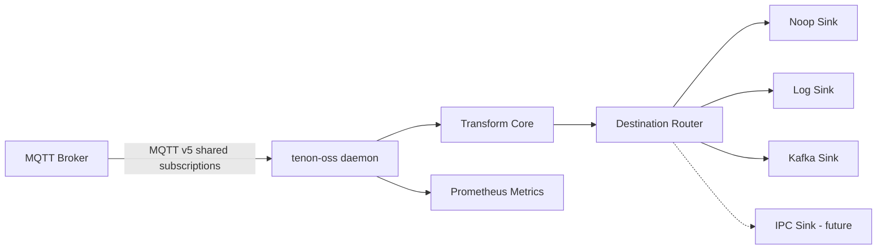

# TENON

TENON is a standalone MQTT event transform daemon.
It subscribes to MQTT topics, evaluates SQL-like transform rules, and routes projected payloads to configured destinations.
The primary release artifact is `tenon-oss`.

## Architecture


```mermaid
flowchart LR
  Broker[MQTT Broker]
  Tenon[tenon-oss daemon]
  Core[Transform Core]
  Router[Destination Router]
  Noop[Noop Sink]
  Log[Log Sink]
  Kafka[Kafka Sink]
  IPC[IPC Sink - future]
  Metrics[Prometheus Metrics]

  Broker -->|MQTT v5 shared subscriptions| Tenon
  Tenon --> Core
  Core --> Router
  Router --> Noop
  Router --> Log
  Router --> Kafka
  Router -.-> IPC
  Tenon --> Metrics
```

## Rule DSL

Rules use a SQL-like syntax with MQTT topic filters.

Examples:

```sql
select * from data
select temp, hum from 'sensors/+/reading' as s where topic_level(s, 2) = 'room1'
select hum + 10 as adjusted_hum from data where temp > 25
```

Supported currently:

- `SELECT *` or `SELECT expr [AS alias]`
- `FROM <topic filter>` with MQTT `+` and `#` wildcards
- `WHERE` with `AND` / `OR`, comparisons, and arithmetic
- `topic_level(alias, index)` with 1-based topic level indexes
- Metadata fields: `qos`, `retain`, `dup`, `timestamp`, `clientId`, `username`
- MQTT v5 properties via `properties['key']`
- JSON payloads
- Protobuf payloads with descriptor-set file and per-rule schema names

## Rule File

```json
{
  "rules": [
    {
      "expression": "select * from data",
      "destinations": ["events_log", "events_kafka"]
    }
  ]
}
```

`destinations` are logical names. The runtime config maps each logical destination to a sink type.

## Sink Config

Built-in sink types:

- `noop`: discard output; useful for load testing.
- `log`: write projected payloads to the TENON log.
- `kafka`: forward projected payload bytes as-is to Kafka.
- `ipc`: forward projected payloads to one local Unix domain socket consumer.

TENON does not define sink-specific payload transformations inside rules. Use `ipc` for custom delivery code.

Example:

```json
{
  "sinks": {
    "events_blackhole": {
      "type": "noop"
    },
    "events_log": {
      "type": "log"
    },
    "events_kafka": {
      "type": "kafka",
      "bootstrap_servers": ["127.0.0.1:9092"],
      "topic": "tenon-output",
      "properties": {
        "queue.buffering.max.messages": "100000",
        "batch.num.messages": "1000",
        "linger.ms": "5",
        "acks": "1"
      }
    },
    "events_custom": {
      "type": "ipc",
      "path": "~/.tenon/ipc/events_custom.sock",
      "queue_capacity": 4096,
      "batch_max_messages": 64,
      "batch_max_bytes": 1048576,
      "flush_interval_millis": 5
    }
  }
}
```

## Config

Minimal config:

```json
{
  "rule_json_path": "examples/tenon-oss/rule.json",
  "payload": {
    "format": "json"
  },
  "mqtt": {
    "host": "127.0.0.1",
    "port": 1883,
    "client_count": 1,
    "username": "dev",
    "password": "dev",
    "group_name": "tenon-oss"
  },
  "sinks": {
    "events_log": {
      "type": "log"
    }
  },
  "metrics": {
    "detailed_latency": false
  }
}
```

If `-c` is omitted, `tenon-oss` uses `~/.tenon/config.json` and provisions a default config/rule when missing.

## Build

Requirements:

- Rust toolchain
- Docker for `./scripts/test.sh all`
- Python only when building the PyPI wrapper

Commands:

```bash
./build.sh tenon-oss       # standalone binary
./build.sh tenon-oss-pypi  # wheel that installs the tenon-oss command
./build.sh all             # same as tenon-oss-pypi
```

Artifacts are written to `build/`:

- `tenon-oss-<version>-<platform>`
- `tenon_oss-<version>-py3-none-<platform>.whl`

## Run

```bash
./build.sh tenon-oss
./build/tenon-oss-0.1.0-darwin-aarch64 -c examples/tenon-oss/config.json
```

On Linux:

```bash
./tenon-oss-0.1.0-linux-x86_64 -c config.json
```

Useful commands:

```bash
tenon-oss -h
tenon-oss --version
```

## Protobuf Input

For protobuf payloads, provide:

- `payload.format = "protobuf"`
- `payload.protobuf_descriptor_set_path`
- `schema_name` on protobuf rules

Example rule:

```json
{
  "rules": [
    {
      "expression": "select temp, hum from data where temp > 25",
      "schema_name": "com.example.Telemetry",
      "destinations": ["events_log"]
    }
  ]
}
```
