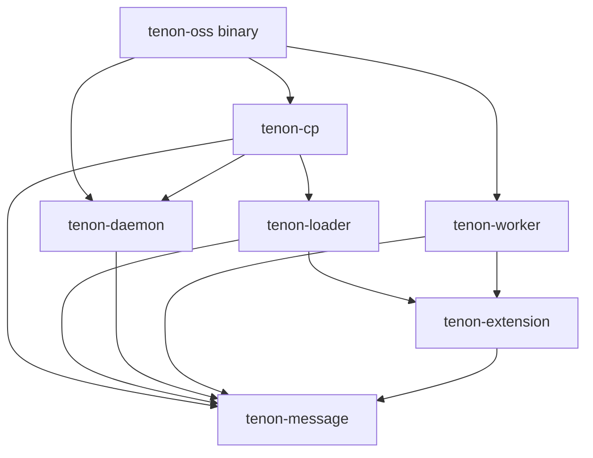
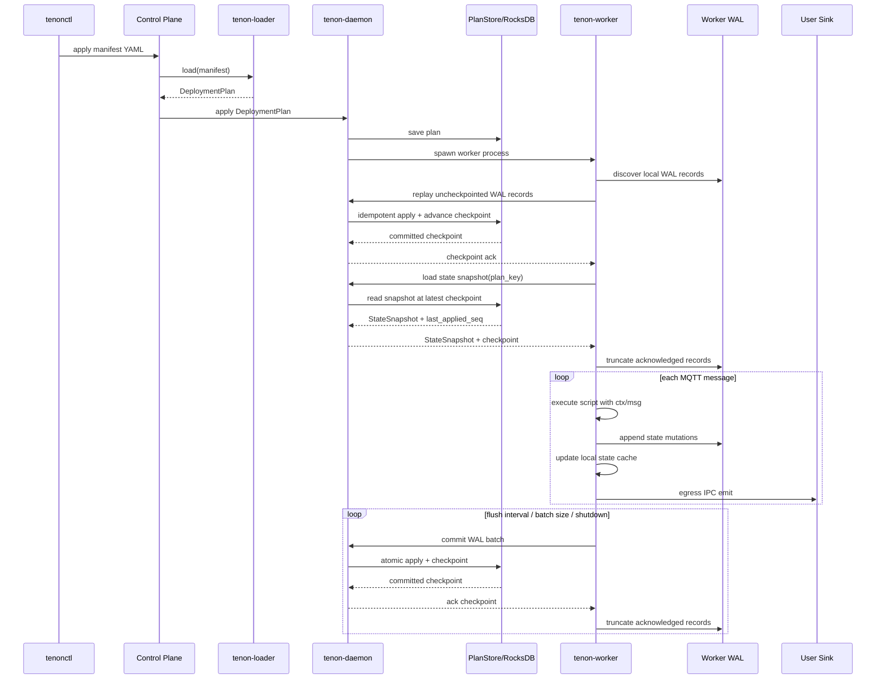

# Tenon Architecture Design

## Scope

Tenon is currently designed as a single-node-first MQTT pipeline runtime. The OSS binary embeds the local control plane and daemon in one process, while workers run as isolated subprocesses launched from the same executable.

The current design optimizes for:

- clear process isolation between daemon, worker, and user sink code;
- deterministic state recovery through worker-local persistent WAL plus daemon-owned checkpointed storage;
- language-neutral extension through IPC rather than JNI/FFI;
- simple OSS deployment before introducing distributed control plane features.

## Components

### tenonctl

`tenonctl` is the operator-facing CLI.

Responsibilities:

- read pipeline manifests;
- resolve local file references before sending manifests;
- submit manifests to the control plane;
- query pipeline/deployment state later.

`tenonctl` does not execute pipelines.

### Control Plane

The control plane owns resource management.

Responsibilities:

- receive pipeline manifests;
- call `tenon-loader` to validate and materialize manifests;
- send validated `DeploymentPlan` messages to `tenon-daemon`;
- provide resource listing/query APIs later.

In OSS v1, the control plane is embedded in the `tenon-oss` process. In a future commercial/distributed deployment, this can become a standalone service.

### tenon-loader

`tenon-loader` converts manifest YAML into a validated `DeploymentPlan`.

Responsibilities:

- parse YAML resources;
- resolve resource references;
- validate resource shape;
- validate Lua extension entry points and basic script API usage;
- emit `tenon-message` protobuf-backed `DeploymentPlan`.

`tenon-loader` does not launch workers and does not persist state.

### tenon-daemon

`tenon-daemon` is the local runtime manager.

Responsibilities:

- accept `DeploymentPlan` from the control plane;
- persist deployment plans;
- spawn worker subprocesses from the same executable;
- track active workers in memory;
- expose daemon-worker IPC;
- own checkpointed state storage;
- apply worker WAL batches atomically to the state store;
- return checkpoints to workers.

The daemon is not on the per-message state read/write path. Workers keep hot state locally.

### tenon-worker

`tenon-worker` executes a deployment.

Responsibilities:

- connect to MQTT brokers;
- ingest MQTT messages;
- build script `Context` and `Message`;
- execute script extension points;
- maintain hot in-memory state cache;
- append state mutations to persistent local WAL;
- batch and flush WAL records to daemon;
- egress emitted records to user sink processes via IPC.

The worker is isolated from the daemon process. A worker crash should not corrupt daemon state.

### User Sink Process

User sink processes contain user-owned downstream integration logic.

Responsibilities:

- receive emitted records from workers through IPC;
- transform and send data to downstream systems;
- isolate user code from Tenon daemon/worker internals.

Tenon does not embed arbitrary user sink logic in the daemon.

### tenon-message

`tenon-message` owns cross-component message contracts.

Responsibilities:

- protobuf definitions for daemon-worker and control-plane messages;
- protobuf-backed `DeploymentPlan`;
- protobuf-backed state messages such as `StateSnapshot` and `StateMutation`;
- frame encoding helpers.

Types that cross process boundaries should be defined here.

### tenon-extension

`tenon-extension` owns script-facing semantics.

Responsibilities:

- define script-visible `Context`;
- define script-visible `Message`;
- define `InvocationOutcome`;
- define `EmitRecord`;
- provide static API metadata used by the loader’s Lua checker.

Script-facing semantic wrappers live here. IPC/data-contract messages live in `tenon-message`.

### Storage

Storage is split logically:

- `PlanStore`: cold control-plane storage for deployment plans.
- `StateStore`: checkpointed runtime state storage.

The intended persistent implementation is RocksDB inside the daemon process.

The in-memory implementation currently uses a `HashMap<Vec<u8>, Vec<u8>>` to match RocksDB key/value semantics:

```text
plan/{plan_key}              -> protobuf DeploymentPlan bytes
state/{plan_key}/{state_key} -> state value bytes
```

## Component Contracts

### Control Plane → Loader

Input:

- manifest YAML string.

Output:

- `Result<DeploymentPlan, LoaderError>`.

Contract:

- the control plane passes a complete manifest string;
- loader validates resource structure and references;
- loader emits a protobuf-backed deployment plan;
- invalid manifests do not reach the daemon.

### Control Plane → Daemon

Input:

- `DeploymentPlan`.

Contract:

- daemon persists the plan before launching/replacing a worker;
- applying a plan with the same deployment key replaces the existing worker for that key;
- daemon can manage multiple deployment workers concurrently.

### Daemon → Worker

Mechanism:

- same executable, different startup arguments;
- daemon starts worker subprocesses.

Contract:

- worker receives enough deployment information to execute one plan;
- worker communicates with daemon using `tenon-message` protobuf contracts;
- daemon tracks worker lifecycle state.

Worker lifecycle states:

```text
Init -> Starting -> Running -> Stopping -> Stopped
                         \-> Error
```

### Worker → Daemon State Contract

Worker startup:

```text
worker discovers local WAL for plan_key
worker sends uncheckpointed WAL records to daemon
daemon applies records idempotently and advances checkpoint
worker asks daemon for snapshot(plan_key)
daemon returns StateSnapshot at the latest checkpoint
worker truncates acknowledged WAL records
worker starts MQTT intake
```

Message processing:

```text
script execution changes worker-local state
worker appends mutation record to local persistent WAL
worker applies mutation to hot in-memory state cache
```

Flush/checkpoint:

```text
worker sends WAL batch to daemon
daemon applies batch atomically to RocksDB
daemon returns checkpoint ack
worker truncates acknowledged WAL records
```

The daemon is the checkpoint authority. The worker is the hot-path state executor.

### Worker → User Sink

Mechanism:

- IPC egress.

Contract:

- worker emits records to user sink processes;
- user sink code is outside Tenon runtime internals;
- fan-out and downstream-specific transformations are user-side concerns.

## Dependency Relationships



Rules:

- cross-process data contracts belong in `tenon-message`;
- script-facing semantic wrappers belong in `tenon-extension`;
- `tenon-loader` may depend on both because it validates scripts and emits deployment plans;
- `tenon-daemon` should not depend on loader;
- `tenon-worker` should not depend on loader.

## Execution Sequence



## State Durability Model

State is intentionally not stored only in memory.

Design:

- worker owns hot in-memory state;
- worker persists mutation records to local WAL before treating them as locally durable;
- daemon owns checkpointed RocksDB state;
- daemon applies WAL batches atomically;
- worker truncates WAL only after daemon checkpoint ack.

This gives deterministic recovery:

```text
worker restart
  -> send local WAL records to daemon for idempotent application
  -> daemon advances checkpoint
  -> load daemon snapshot at latest checkpoint
  -> truncate acknowledged WAL records
  -> resume MQTT intake
```

The daemon state store should later track `last_applied_seq_no` per plan so replayed WAL records are idempotent.

## Trade-offs

### Single-node-first

Current OSS design is single-node-first.

Pros:

- simpler operational model;
- easier to reason about state and worker lifecycle;
- avoids premature distributed consensus complexity;
- sufficient for many MQTT pipeline deployments.

Cons:

- no built-in multi-node HA yet;
- no cross-node worker reassignment yet;
- state is local to one daemon node.

### Embedded CP and Daemon in OSS

In OSS, the control plane and daemon live in the same process.

Pros:

- one binary;
- simpler local deployment;
- lower operational overhead;
- easy trial experience.

Cons:

- binary includes local control-plane logic even when a future external CP exists;
- process boundary is logical, not physical;
- distributed control-plane behavior is deferred.

### Worker as Subprocess

Workers are separate processes launched by the daemon from the same executable.

Pros:

- worker crashes do not directly crash daemon;
- runtime execution is isolated from control/state management;
- future per-worker resource control is easier;
- user sees one command even though daemon launches workers internally.

Cons:

- more process management complexity;
- daemon-worker IPC is required;
- startup/shutdown ordering must be explicit.

### User Sink Out of Process

User sink logic runs outside Tenon runtime internals.

Pros:

- avoids unsafe/untrusted user callbacks inside Rust runtime;
- language-neutral extension path;
- avoids JNI/FFI as the main extension boundary;
- simplifies runtime memory-safety reasoning.

Cons:

- IPC overhead exists;
- user sink lifecycle management is external;
- schema/protocol documentation becomes important.

### Worker WAL + Daemon RocksDB

Worker uses local persistent WAL; daemon owns RocksDB checkpoint state.

Pros:

- avoids RocksDB in the per-message hot path;
- gives deterministic crash recovery;
- keeps one RocksDB instance per daemon instead of one per worker;
- preserves state durability beyond in-memory buffering.

Cons:

- WAL replay/checkpoint protocol is more complex;
- sequence numbers and idempotent commit semantics are required;
- worker local disk management is required.

### Proto-backed Contracts

Cross-process contracts are protobuf-backed through `tenon-message`.

Pros:

- stable IPC contract;
- language-neutral;
- binary serialization;
- avoids duplicate hand-written IPC structs.

Cons:

- generated Rust structs use optional fields and integer enums;
- loader and daemon must validate required fields;
- proto models are less ergonomic than hand-written Rust domain structs.
