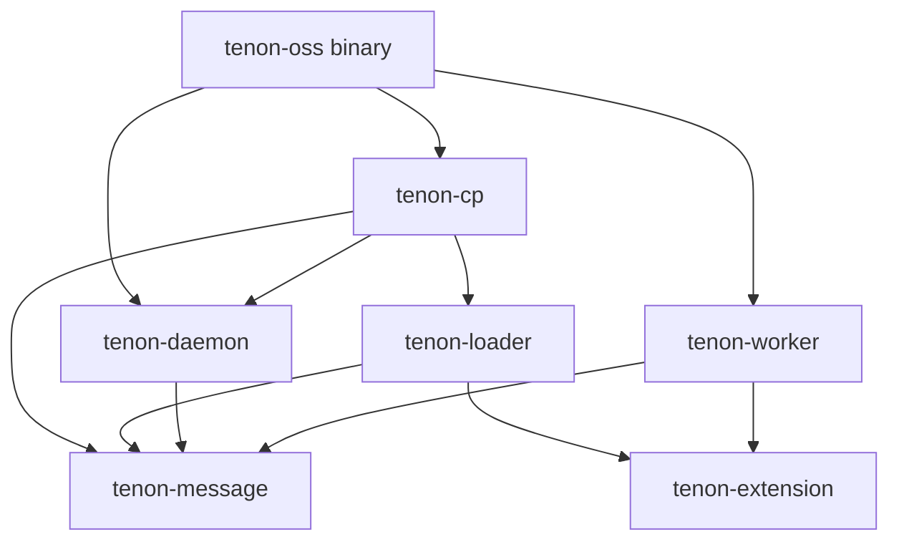
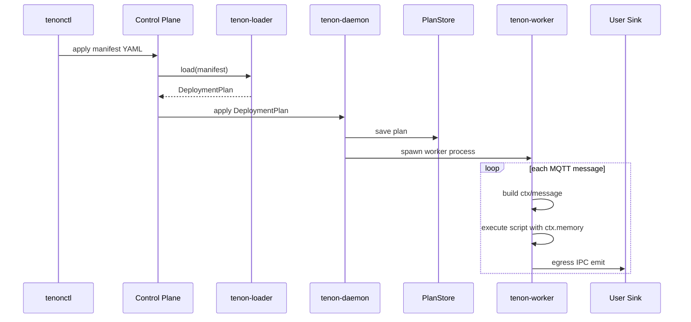

# Tenon Architecture Design

## Scope

Tenon is currently designed as a single-node-first MQTT pipeline runtime.

The OSS binary embeds the local control plane and daemon in one process. Workers run as isolated subprocesses launched from the same executable. User sink logic stays outside the Tenon runtime and communicates through IPC.

The current design optimizes for:

- clear process isolation between daemon, worker, and user sink code;
- persistent pipeline definition rather than persistent message-processing state;
- language-neutral extension through IPC rather than JNI/FFI;
- simple OSS deployment before introducing distributed control plane features.

## Components

### `tenonctl`

`tenonctl` is the operator-facing CLI.

Responsibilities:

- read pipeline manifests;
- resolve local file references before sending manifests;
- submit manifests to the control plane;
- query pipeline and deployment status later.

`tenonctl` does not execute pipelines.

### Control Plane

The control plane owns resource management.

Responsibilities:

- receive pipeline manifests;
- call `tenon-loader` to validate and materialize manifests;
- send validated `DeploymentPlan` messages to `tenon-daemon`;
- provide resource listing and query APIs later.

In OSS v1, the control plane is embedded in the `tenon-oss` process. In a future commercial or distributed deployment, this can become a standalone service.

### `tenon-loader`

`tenon-loader` converts manifest YAML into a validated `DeploymentPlan`.

Responsibilities:

- parse YAML resources;
- resolve resource references;
- validate resource shape;
- validate Lua extension entry points and basic script API usage;
- emit protobuf-backed `DeploymentPlan`.

`tenon-loader` does not launch workers and does not persist runtime memory.

### `tenon-daemon`

`tenon-daemon` is the local runtime manager.

Responsibilities:

- accept `DeploymentPlan` from the control plane;
- persist deployment plans;
- spawn worker subprocesses from the same executable;
- track active workers in memory;
- expose daemon-worker IPC;
- manage worker lifecycle.

The daemon owns persistent pipeline definition. It does not own message-processing memory in v1.

### `tenon-worker`

`tenon-worker` executes a deployment.

Responsibilities:

- connect to MQTT brokers;
- ingest MQTT messages;
- build script `Context` and `Message`;
- execute script extension points;
- maintain worker-local runtime memory;
- egress emitted records to user sink processes via IPC.

The worker is isolated from the daemon process. A worker crash should not corrupt persisted pipeline definition.

### User Sink Process

User sink processes contain user-owned downstream integration logic.

Responsibilities:

- receive emitted records from workers through IPC;
- transform and send data to downstream systems;
- isolate user code from Tenon daemon and worker internals.

Tenon does not embed arbitrary user sink logic in the daemon.

### `tenon-message`

`tenon-message` owns cross-component message contracts.

Responsibilities:

- protobuf definitions for daemon-worker and control-plane messages;
- protobuf-backed `DeploymentPlan`;
- frame encoding helpers.

Types that cross process boundaries should be defined here.

### `tenon-extension`

`tenon-extension` owns script-facing semantics.

Responsibilities:

- define script-visible `Context`;
- define script-visible `Message`;
- define worker-local `memory` semantics;
- define `InvocationOutcome`;
- define `EmitRecord`;
- provide static API metadata used by the loader’s Lua checker.

Script-facing semantic wrappers live here. IPC and plan contracts live in `tenon-message`.

### Storage

Storage is intentionally narrow in v1.

- `PlanStore`: persistent storage for deployment plans.

The intended persistent implementation can remain simple. A filesystem-backed store is sufficient for v1 because only pipeline definition is persisted. RocksDB is not required for the current scope.

## Component Contracts

### Control Plane → Loader

Input:

- manifest YAML string.

Output:

- `Result<DeploymentPlan, LoaderError>`.

Contract:

- the control plane passes a complete manifest string;
- loader validates resource structure and references;
- loader emits a protobuf-backed deployment plan;
- invalid manifests do not reach the daemon.

### Control Plane → Daemon

Input:

- `DeploymentPlan`.

Contract:

- daemon persists the plan before launching or replacing a worker;
- applying a plan with the same deployment key replaces the existing worker for that key;
- daemon can manage multiple deployment workers concurrently.

### Daemon → Worker

Mechanism:

- same executable, different startup arguments;
- daemon starts worker subprocesses.

Contract:

- worker receives enough deployment information to execute one plan;
- worker communicates with daemon using `tenon-message` protobuf contracts;
- daemon tracks worker lifecycle state.

Worker lifecycle states:

```text
Init -> Starting -> Running -> Stopping -> Stopped
                         \-> Error
```

### Worker Runtime Memory

`ctx.memory` is worker-local runtime memory.

Contract:

- `ctx.memory` exists only within one worker process lifetime;
- `ctx.memory` is not checkpointed;
- `ctx.memory` is reset when the worker restarts;
- `ctx.memory` is suitable for trigger timing and short-lived runtime coordination;
- if users need durable business state, they should externalize it in their own downstream systems.

This is intentionally not streaming state. Tenon v1 does not claim replay-safe persistent compute-state semantics.

### Worker → User Sink

Mechanism:

- IPC egress.

Contract:

- worker emits records to user sink processes;
- user sink code is outside Tenon runtime internals;
- downstream-specific transformations are user-side concerns;
- fan-out beyond the worker’s single egress boundary is also user-side.

## Dependency Relationships



Rules:

- cross-process data contracts belong in `tenon-message`;
- script-facing semantic wrappers belong in `tenon-extension`;
- `tenon-loader` may depend on both because it validates scripts and emits deployment plans;
- `tenon-daemon` should not depend on loader;
- `tenon-worker` should not depend on loader.

## Execution Sequence



## Trade-offs

### Single-node-first

Current OSS design is single-node-first.

Pros:

- simpler operational model;
- easier to reason about worker lifecycle;
- avoids premature distributed consensus complexity;
- sufficient for many MQTT pipeline deployments.

Cons:

- no built-in multi-node HA yet;
- no cross-node worker reassignment yet;
- persistent plan data is local to one node.

### Embedded Control Plane and Daemon in OSS

In OSS, the control plane and daemon live in the same process.

Pros:

- one binary;
- simpler local deployment;
- lower operational overhead;
- easier trial experience.

Cons:

- binary includes local control-plane logic even when a future external control plane exists;
- process boundary is logical, not physical;
- distributed control-plane behavior is deferred.

### Worker as Subprocess

Workers are separate processes launched by the daemon from the same executable.

Pros:

- worker crashes do not directly crash daemon;
- runtime execution is isolated from control and lifecycle management;
- future per-worker resource control is easier;
- user sees one command even though daemon launches workers internally.

Cons:

- more process management complexity;
- daemon-worker IPC is required;
- startup and shutdown ordering must be explicit.

### User Sink Out of Process

User sink logic runs outside Tenon runtime internals.

Pros:

- avoids unsafe or untrusted user callbacks inside the Rust runtime;
- language-neutral extension path;
- avoids JNI and FFI as the main extension boundary;
- simplifies runtime memory-safety reasoning.

Cons:

- IPC overhead exists;
- user sink lifecycle management is external;
- schema and protocol documentation becomes important.

### Ephemeral Worker Memory

Worker runtime memory is intentionally ephemeral.

Pros:

- semantics are explicit and honest;
- avoids pretending Tenon is a replay-safe streaming engine;
- keeps the worker execution model simple;
- avoids WAL, checkpoint, and deduplication machinery in v1.

Cons:

- worker restart resets runtime memory;
- trigger-like logic restarts from a clean slate after worker restart;
- durable business state must be handled outside Tenon.

### Proto-backed Contracts

Cross-process contracts are protobuf-backed through `tenon-message`.

Pros:

- stable IPC contract;
- language-neutral;
- binary serialization;
- avoids duplicate hand-written IPC structs.

Cons:

- generated Rust structs use optional fields and integer enums;
- loader and daemon must validate required fields;
- proto models are less ergonomic than hand-written Rust domain structs.
